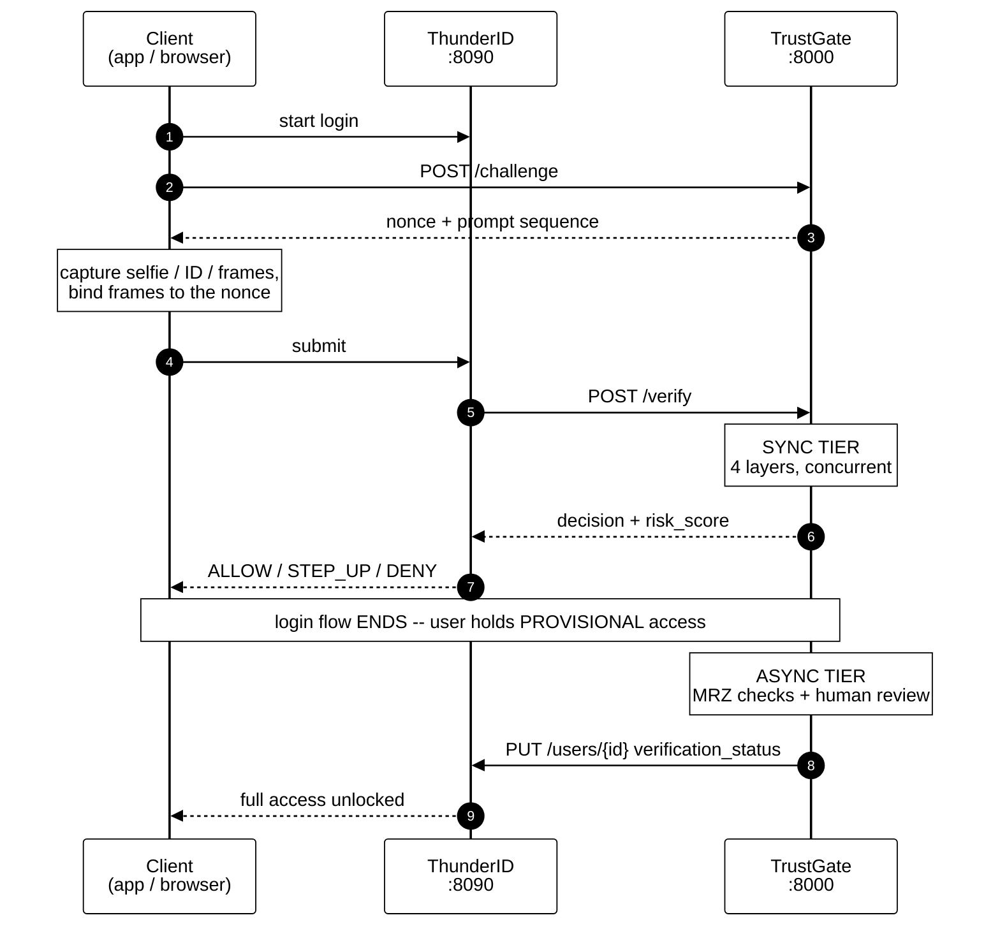
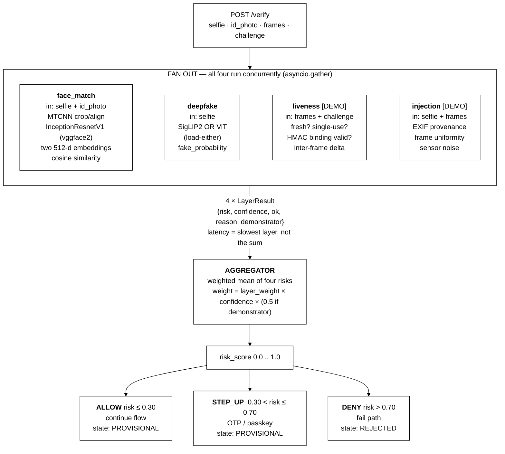
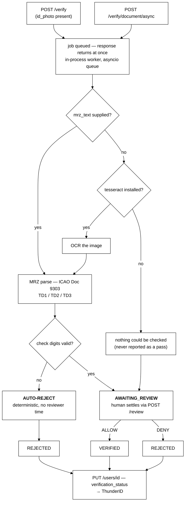
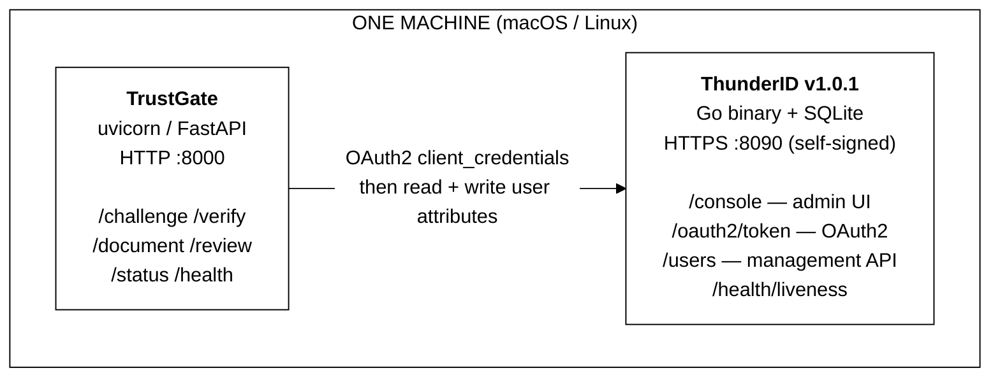
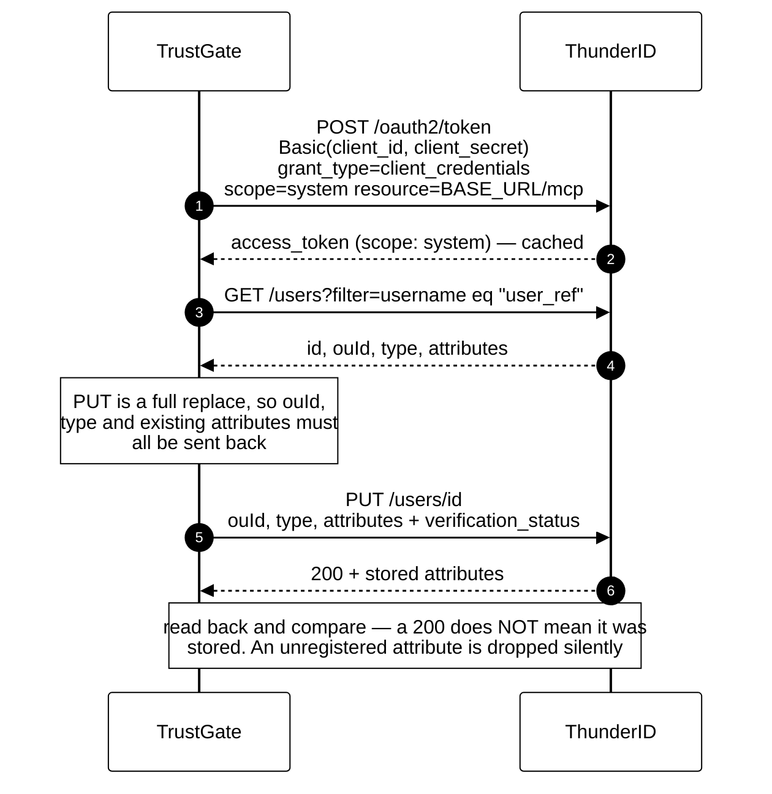
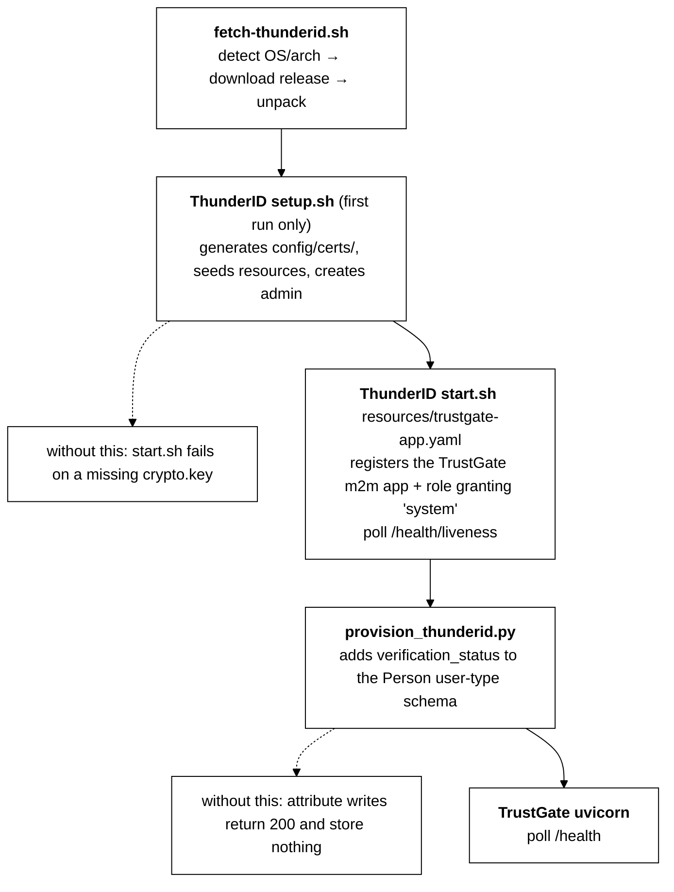
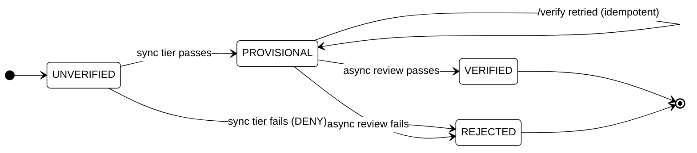
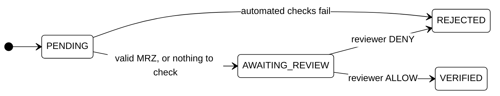

# TrustGate

External identity-verification service (Python / FastAPI) for an adaptive-auth
onboarding/login flow. It runs several verification layers concurrently,
aggregates them into one risk decision, and settles full verification later via
an asynchronous document-review tier.

- **Sync tier** — answers inline, ~46 ms warm on an M4 (see Latency)
- **Async tier** — settles out of band, after the flow has ended
- **Two integration points** — a flat JSON risk decision inline; a user-attribute
  write out of band

---

## Architecture at a glance



**The key idea:** step 5 ends the flow. Steps 6–7 happen with *no flow running* —
which is exactly what makes a slow, human-in-the-loop document check possible
without holding a login open.

---

## Sync tier pipeline



### Layers and models

| Layer | Model / method | Real? | Default |
|---|---|---|---|
| `face_match` | MTCNN → InceptionResnetV1 (`vggface2`) → cosine similarity | Real | **Off** (mock stub) |
| `deepfake` | SigLIP2 or ViT image classifier (load-either) | Real | **Off** (mock stub) |
| `liveness` | Challenge binding + inter-frame delta heuristics | Demonstrator | **On** |
| `injection` | EXIF provenance + sensor-noise heuristics | Demonstrator | **On** |

Model-backed layers are off by default so tests and startup stay fast and
network-free. Every result carries a `demonstrator` flag, and the aggregator
down-weights those layers.

**Checkpoints** (both Apache-2.0, ungated, cached to `.cache/huggingface/`):

| `model_choice` | Checkpoint | Base |
|---|---|---|
| `vit` (default) | `prithivMLmods/Deep-Fake-Detector-v2-Model` | `google/vit-base-patch16-224-in21k` |
| `siglip2` | `prithivMLmods/Deepfake-Detect-Siglip2` | `google/siglip2-base-patch16-224` |

Each checkpoint's native label order is normalised inside the layer into a
canonical `fake_probability`, so the aggregator never needs to know which is
active.

---

## Async tier pipeline



Poll `GET /document/{job_id}` for status, findings and extracted MRZ fields.

---

## Deployment (PoC)

`./deployment/start-all.sh` runs both services on one machine, so TrustGate is
developed against the real identity product rather than a mock.



How TrustGate writes a settled verification back:



| Path | Purpose |
|---|---|
| `deployment/dist/` | Unpacked ThunderID distribution — gitignored, ~115MB |
| `deployment/run/` | Logs and pid files — gitignored |
| `deployment/resources/trustgate-app.yaml` | Applied at ThunderID startup |
| `deployment/provision_thunderid.py` | Run once ThunderID is up |

### Startup sequence



Both services are launched detached (`nohup`, own process group), so they
outlive the launching shell and can be stopped independently.

### Provisioning: two mechanisms, and why

| What | How | Why not the other way |
|---|---|---|
| TrustGate app + role | Declarative YAML passed to `start.sh` | Creating it via API needs a token, which needs the app — circular |
| `verification_status` on the schema | `provision_thunderid.py` (authenticated) | Cannot be expressed in the startup resources file |

See [deployment/README.md](deployment/README.md) for the full API contract and
four non-obvious behaviours that will otherwise bite.

---

## Quickstart

```bash
python3 -m venv .venv
source .venv/bin/activate
pip install -r requirements.txt

# TrustGate alone
uvicorn app.main:app --reload
curl http://127.0.0.1:8000/health          # {"status":"ok"}

# TrustGate + ThunderID together
./deployment/fetch-thunderid.sh            # one-time, ~34MB
./deployment/start-all.sh
./deployment/stop-all.sh
```

Optional — enables MRZ OCR (otherwise pass `mrz_text` yourself):

```bash
brew install tesseract && pip install pytesseract
```

Exercise the whole flow against a running server:

```bash
./scripts/demo.sh          # BASE_URL and USER_REF are overridable
```

---

## Fail posture

What happens when a layer cannot produce a result — a model fails to load, an
inference throws, a bug escapes. Configured by
`ResilienceSettings.layer_fail_posture`.

**A broken layer never fails the request.** Layer coroutines are gathered with
`return_exceptions`, so one failure is converted into a `LayerResult` rather
than propagating: a single buggy layer cannot 500 the whole verification.

| Posture | A failed layer... | Effect |
|---|---|---|
| `FAIL_CLOSED` *(default)* | counts as maximum risk, at full confidence | the attempt cannot be cleanly approved |
| `FAIL_OPEN` | is excluded from scoring entirely (zero weight) | the remaining layers decide alone |

**Why FAIL_CLOSED is the default:** this is a security control, so a check that
did not run must not be treated as a check that passed. Otherwise an attacker
who can reliably induce an error in one layer has found a way to shed it.

**The floor.** Scoring by weighted mean alone lets three healthy layers dilute
one that never ran, which can still land in ALLOW. Under `FAIL_CLOSED` the
aggregate risk is therefore floored just into `STEP_UP` — a failure downgrades
to "ask for more", not "approve anyway". It floors the *score* rather than
overriding the *decision*, so `risk_score` and `decision` never disagree.

`FAIL_OPEN` favours availability and accepts the trade. Note where it
degenerates: if *every* layer fails, nothing carries weight, the score is 0.0
and the result is ALLOW — an empty verification approving by default. That is
the honest consequence of the setting, and the reason it is not the default.

## Latency

The sync tier is what the login flow waits on, so it is measured rather than
assumed. Every response carries `total_duration_ms`, and each entry in `layers`
carries its own `duration_ms`.

Measured on an Apple M4 Pro, CPU, both model-backed layers enabled and warm
(`pytest -m slow tests/test_latency_real.py`):

| Layer | Time |
|---|---|
| `deepfake` (ViT, 224×224) | 44.1 ms |
| `face_match` (MTCNN + InceptionResnetV1) | 22.2 ms |
| `liveness` | 1.8 ms |
| `injection` | 1.8 ms |
| **Total** | **46.1 ms** |

Serial execution would be 70.0 ms, so concurrency is doing real work: the total
tracks the slowest layer, not the sum.

**Read these as a floor, not a promise:**

- **Synthetic inputs.** MTCNN finds no face in a noise image and short-circuits,
  so `face_match` on a real capture will cost more than 22 ms.
- **Warm.** The first call after startup pays model loading and a cold inference
  — that first deepfake call measured ~600 ms. Load models at startup, not on
  the first request.
- **CPU only.** No MPS or GPU acceleration.

Both budgets are configurable (`LatencySettings`): a soft `budget_ms` (5 s
default) that logs a warning, and a `hard_ceiling_ms` (20 s) matching the
calling flow engine's limit, which logs an error — past that the flow has
already failed, so it is not merely slow.

Every request logs its breakdown:

```
app.orchestrator: sync tier 46ms (slowest layer 44ms, serial would be 70ms):
face_match=22ms, liveness=2ms, deepfake=44ms, injection=2ms
```

Set `TRUSTGATE_LOG_LEVEL` to change verbosity (default `INFO`). Only this
project's loggers are configured, so raising it does not drown the output in
torch/httpx noise.

## API reference

| Endpoint | Purpose |
|---|---|
| `POST /challenge` | Issue `{challenge_id, prompt_sequence, nonce, expires_at}` for the liveness handshake |
| `POST /verify` | Run the sync tier; return flat `VerifyResponse`; queue a doc job if `id_photo` present |
| `POST /verify/document/async` | Queue a doc job directly, outside the sync flow |
| `GET /document/{job_id}` | Doc job status, findings, extracted MRZ fields |
| `GET /status/{user_ref}` | Current verification state |
| `POST /review/{job_id}` | Human settle: `{decision, reviewer_note}` |

`/verify` form fields:

- **Required** — `challenge_id`, `user_ref`, `selfie`
- **Optional** — `id_photo`, `liveness_frames[]`, `frame_binding`, `mrz_text`

### Verification state machine



- `VERIFIED` and `REJECTED` are **terminal**
- `PROVISIONAL -> PROVISIONAL` is allowed, so a retried `/verify` does not fail

### Document job status



A settled job cannot be reviewed again (`409`).

---

## Layer detail and honest limitations

Every layer self-reports. Read `demonstrator: true` as "this is deliberately
weak", never as a production control.

### Face match — real

- **MTCNN** detects, crops and aligns each face; **InceptionResnetV1**
  (`vggface2` by default, or `casia-webface`) embeds it
- Cosine similarity → risk, anchored so `similarity == threshold` maps to
  exactly `0.5` — a pair that fails the threshold can never score as ALLOW
- Confidence is MTCNN's **detection probability**, not distance from the
  threshold, so borderline comparisons keep full weight in the aggregator
- No face detected in either image → maximum risk, not an error
- Weights cache to `.cache/torch/` via `TORCH_HOME`
- MTCNN/InceptionResnetV1 are **vendored** into
  `app/layers/_vendor/facenet_pytorch/` (MIT) — the PyPI release pins
  `torch<2.3.0` / `numpy<2.0.0` / `Pillow<10.3.0`, which will not build on
  recent Python. See that directory's README for exactly what changed
  (nothing behavioural)

### Deepfake — real

- Load-either SigLIP2 / ViT classifier; emits `fake_probability` → risk
- **Treat as a risk signal, not a verdict** — it does not generalise to unseen
  generators
- Corrupt/undecodable input returns a graded result rather than a 500

### Liveness — demonstrator

**What it genuinely enforces, server-side:**

| Check | Catches |
|---|---|
| Challenge exists, unexpired | Attempts not tied to a fresh server-issued challenge |
| Challenge is single-use | Re-presenting an earlier attempt's `challenge_id` |
| Frame binding (HMAC, optional) | Wholesale replay of a previously captured payload |
| Frame count | Payloads too thin to assess |
| Inter-frame pixel delta | One still image submitted as a capture |

**Frame binding** = `HMAC(nonce, frames)`, sent as the optional `frame_binding`
field. It proves the payload was assembled by something holding *this*
challenge's nonce. It does **not** prove live capture — the nonce reaches the
client in the clear, so anyone who can request a challenge can bind
pre-recorded footage. Omitting it is scored as a real gap, not ignored.

**What it does NOT do:**

- **Does not verify the prompted actions happened.** The challenge asks for
  "blink, nod, open_mouth" and nothing checks that any of it occurred — that
  needs action recognition, out of scope here
- **Not a certified PAD control.** No iBeta or equivalent testing; none claimed
- **Motion check is crude.** Distinguishes a repeated still from *something*
  changing; cannot distinguish a live face from a video, mask or screen replay
- **A clean pass never scores zero** — floors at `baseline_risk` 0.2, with
  `confidence` capped at 0.35

### Injection — demonstrator, the weakest layer here

**Injection** = bypassing the camera entirely (virtual camera, emulator, direct
API feed), as distinct from a *presentation* attack held to a real lens.

Be clear-eyed: **detecting this from uploaded stills is close to a lost cause.**
Production systems solve it with **client attestation** (Play Integrity, App
Attest), proving frames came from a real camera on an untampered device. This
service receives an HTTP upload and can attest nothing about its origin.

| Signal | Rationale | Why it's weak |
|---|---|---|
| EXIF `Software` vs. known markers | Tooling often leaves a trace | Trivially stripped or spoofed |
| Missing camera make/model | Synthetic frames often carry none | Many clients strip EXIF for privacy |
| Missing capture timestamp | Incomplete provenance | Same |
| Identical frame byte lengths | Real frames rarely match exactly | Easy to vary |
| Sensor-noise floor | Real sensors are never perfectly smooth | A photo of a blank wall scores low |
| Frame dimension disagreement | One session should be consistent | Easy to normalise |

- Scored to be leaned on least: **lowest confidence (0.2)**, **highest baseline
  risk (0.3)**
- Expect **false positives** on privacy-conscious clients and **false
  negatives** on any attacker who forges metadata and adds noise
- Do not tune a hard gate on this layer's output

### MRZ check digits — the one deterministic signal

Everything else here is a score with a threshold. MRZ check digits are not:
ICAO Doc 9303 defines them, and they either verify or they do not.

- Parses **TD1** (3×30), **TD2** (2×36), **TD3** (2×44)
- Validated in the test suite against the **official specimen in Doc 9303
  Part 4** — checked against the standard, not merely against itself

**What a valid MRZ proves:** the fields agree with their check digits, i.e. the
transcription is internally consistent.

**What it does not prove:**

- **Not authenticity.** Check digits are a transcription-integrity mechanism.
  Anyone fabricating a document computes valid ones as a matter of course —
  which is exactly why a passing MRZ *escalates to human review* rather than
  approving anything
- **Not that tampering is caught.** Modulo-10 check digits are blind to any
  alteration whose weighted contribution shifts by a multiple of 10 — roughly
  **one random alteration in ten passes silently**. Worked example on the ICAO
  specimen in `tests/test_mrz.py`, kept as a test so it is not later mistaken
  for a bug

A **failing** check digit is unambiguous, so the worker rejects outright and
settles state without spending reviewer time.

**OCR** is optional and absent by default — tesseract is a system package, not a
pip dependency. With no `mrz_text` and no OCR, the job reports that nothing
could be checked and escalates; absence of a check is never reported as a pass.

---

## Integration contract

### 1. Inline (synchronous) — HTTP-request executor

`decision` and `risk_score` are deliberately **top-level, flat JSON**, so they
map onto a simple field path with no nesting to traverse:

```json
{
  "user_ref": "demo-user",
  "state": "PROVISIONAL",
  "decision": "ALLOW",
  "risk_score": 0.28,
  "reasons": ["injection: risk=0.56"],
  "layers": ["...per-layer detail, each with duration_ms..."],
  "document_job_id": "88632a8e-4dbe-49c4-9895-5efbd5b4fa19",
  "total_duration_ms": 46.1
}
```

```text
responseMapping:
  decision   -> $.decision
  risk_score -> $.risk_score

branch on decision:
  ALLOW   -> continue flow
  STEP_UP -> step-up executor (OTP / passkey)
  DENY    -> fail path
```

- Respect the flow engine's `failOnError` semantics for the case where
  TrustGate itself is unreachable — that is the caller's decision, not this
  service's
- For a *layer* failing inside TrustGate, see Fail posture below

### 2. Out-of-band (asynchronous) — user-attribute write

Implemented and **verified against a running ThunderID**, behind a narrow
adapter (`app/integrations/thunderid_client.py`).

- **Off by default** (`ThunderIdSettings.enabled = False`) — a null
  implementation logs intent and returns `False`, so "not configured" can never
  be mistaken for "written"
- Written on async settle: reviewer decision, or automated MRZ rejection

| | |
|---|---|
| Attribute | `verification_status` (configurable) |
| Values | `UNVERIFIED` / `PROVISIONAL` / `VERIFIED` / `REJECTED` |
| Source of truth | TrustGate's local state store |
| User matched by | `username` (configurable; `id` treats `user_ref` as the ThunderID user id) |

The value written is always `VerificationState.value` — the same enum the local
store uses, so the two cannot drift in representation.

**Three behaviours the adapter exists to handle** (all confirmed against a real
server, not read off the spec):

1. **Token requests need an RFC 8707 `resource` parameter**, else
   `invalid_target`
2. **`PUT /users/{id}` is a full replace** — requires `ouId` and `type`, so
   every update is a read-modify-write
3. **Unregistered attributes are dropped silently, with a `200`.** The adapter
   therefore **reads the attribute back** and treats a mismatch as failure,
   rather than reporting a success that did not happen

**Failure handling:**

- Transient failures retried with backoff
- Permanent failures fail fast (unknown user, ambiguous match, missing scope,
  rejected attribute)
- An ambiguous username match **refuses to write** — putting verification state
  on the wrong account is worse than not writing it
- Returns `False`, never raises: the local store is the system of record and the
  verification has already settled, so an unreachable ThunderID must not undo it
  or fail a reviewer's action

**Session/token caveat:** flipping `verification_status` out of band does not
change an already-issued token. Either the user picks it up on next
login/refresh, or the downstream app reads `verification_status` live when
gating sensitive actions.

---

## Tests

```bash
pytest             # fast suite, no network or model downloads
pytest -m slow     # real model inference; needs images you supply
```

`slow` tests skip cleanly when their images are absent — see
[samples/README.md](samples/README.md).
